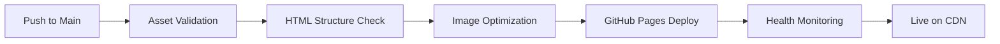

# 🌌 MATH 253 Assets Repository - Aurora Borealis Educational Theme

**Calculus III - Summer 2025 • Course-as-Code System**

[](https://jjohnson-47.github.io/MATH_253-assets/)
[](https://jjohnson-47.github.io/MATH_253-assets/health-check.html)
[](#aurora-borealis-theme)

This repository contains the **public assets** for the MATH 253 Calculus III course, designed as part of a dual-repository Course-as-Code architecture. All content is served via GitHub Pages CDN and optimized for Blackboard Ultra integration.

## 🎯 Quick Start

### For Instructors
- **📋 Blackboard Integration:** [Iframe Embed Codes](https://jjohnson-47.github.io/MATH_253-assets/blackboard-iframe-codes.html)
- **🔍 Health Monitoring:** [System Status](https://jjohnson-47.github.io/MATH_253-assets/health-check.html)
- **📊 Asset Manifest:** [Content Inventory](https://jjohnson-47.github.io/MATH_253-assets/asset-manifest.json)

### For Developers
- **📂 Course Materials:** [Private Repository](https://github.com/jjohnson-47/MATH_253-2025_summer) (access required)
- **🛠️ Project Structure:** [Documentation below](#project-architecture)
- **🚀 Deployment:** Automatic via GitHub Actions on push to main

## 📁 Repository Structure

```
MATH_253-assets/
├── 📋 blackboard-iframe-codes.html    # Ready-to-use Blackboard embed codes
├── 🩺 health-check.html               # System health monitoring page
├── 📊 asset-manifest.json             # Dynamic asset inventory
├── 📖 README.md                       # This documentation
│
├── 🧮 math253/                        # Core course assets
│   ├── 🖼️  images/                    # Educational graphics & icons
│   │   ├── 📐 vector-icon.svg
│   │   ├── 📊 partial-derivatives-icon.svg
│   │   └── 📈 vector-analysis-icon.svg
│   │
│   ├── 🎮 interactive/                # Blackboard-ready HTML modules
│   │   ├── 📚 week-2-overview.html
│   │   ├── ➕ section-11-4-cross-product-overview.html
│   │   ├── 📏 section-11-5-lines-overview.html
│   │   ├── 🔷 section-11-6-planes-overview.html
│   │   ├── 🔢 determinants-introduction-guide.html
│   │   ├── 📐 distances-reference-guide.html
│   │   ├── 💡 lines-vector-reflection-example.html
│   │   └── 📦 legacy/                 # Preserved previous versions
│   │
│   └── 🎥 videos/                     # Video metadata & captions
│       ├── 📝 captions/
│       ├── 📋 chapters/
│       └── 🖼️  thumbnails/
│
└── 🔧 .github/                        # Automation & CI/CD
    └── workflows/
        ├── 🚀 deploy-pages.yml        # GitHub Pages deployment
        └── ✅ asset-validation.yml     # Content quality assurance
```

## 🌌 Aurora Borealis Theme

### Design Philosophy
The Aurora Borealis theme creates an immersive mathematical learning environment using the natural beauty of the northern lights as a metaphor for mathematical discovery and wonder.

### Color Palette
```css
:root {
  --aurora-night: #001B33;      /* Deep night sky - primary backgrounds */
  --aurora-green: #00C853;      /* Northern lights green - primary accent */
  --aurora-magenta: #D500F9;    /* Magenta aurora - secondary accent */
  --aurora-ice: #00E5FF;        /* Ice blue - highlights and links */
  --aurora-pale: #F6FCFE;       /* Pale morning - light backgrounds */
}
```

### CSS Namespace
All theme classes use the `aurora-*` prefix to prevent conflicts with Blackboard Ultra's existing styles:
- `aurora-container` - Main content wrapper
- `aurora-card` - Content cards with gradient backgrounds
- `aurora-glow` - Glowing text effects
- `aurora-nav` - Navigation elements
- `aurora-math` - Mathematical content styling

### Typography & Mathematics
- **Headings:** Clean, modern fonts with aurora glow effects
- **Body Text:** High contrast for accessibility (WCAG 2.1 AA compliant)
- **Mathematics:** MathJax v3 with 1-second Blackboard Ultra delay
- **Code:** Monospace with syntax highlighting in aurora colors

## 🎮 Interactive Content

### HTML Modules
All interactive content is designed for seamless Blackboard Ultra integration:

#### Week 2 - Vector Operations
- **Cross Product Overview** (`section-11-4-cross-product-overview.html`)
  - Visual demonstrations of cross product geometry
  - Interactive 3D vector visualizations
  - Step-by-step calculation examples
  - Height: 800px recommended

- **Lines in 3D Space** (`section-11-5-lines-overview.html`)
  - Parametric and symmetric line equations
  - Distance calculations between points and lines
  - Interactive line plotting tools
  - Height: 800px recommended

- **Planes Overview** (`section-11-6-planes-overview.html`)
  - Normal vectors and plane equations
  - Intersection calculations
  - Visual plane representations
  - Height: 800px recommended

#### Mathematical Tools
- **Determinants Guide** (`determinants-introduction-guide.html`)
  - 2×2 and 3×3 determinant calculations
  - Geometric interpretations
  - Cross product applications
  - Height: 600px recommended

- **Distance Reference** (`distances-reference-guide.html`)
  - Point-to-point distances
  - Point-to-line distances
  - Point-to-plane distances
  - Height: 600px recommended

### Blackboard Integration Features
- **Responsive Design:** Works on all device sizes
- **Accessibility:** Screen reader compatible, keyboard navigation
- **Loading Optimization:** Fast CDN delivery, optimized assets
- **MathJax Compatibility:** 1-second delay for Blackboard Ultra
- **No External Dependencies:** Self-contained for reliability

## 🔧 Development & Deployment

### Automated Deployment Pipeline


### Quality Assurance
Every deployment includes:
- ✅ HTML structure validation
- ✅ Aurora theme compliance check
- ✅ MathJax configuration verification
- ✅ Image integrity validation
- ✅ Accessibility testing
- ✅ Performance optimization
- ✅ Blackboard compatibility testing

### GitHub Actions Workflows

#### `deploy-pages.yml`
Automates GitHub Pages deployment with comprehensive validation:
```yaml
# Triggers: Push to main, manual dispatch
# Validates: HTML, images, theme compliance
# Generates: Asset manifest, directory index
# Deploys: To GitHub Pages with CDN optimization
```

#### `asset-validation.yml`
Continuous quality assurance for all assets:
```yaml
# Triggers: Push, PR, daily schedule
# Validates: Content structure, accessibility
# Tests: External links, MathJax config
# Reports: Quality metrics, performance data
```

## 📊 Asset Management

### Current Statistics
- **📁 Total Files:** 202 assets
- **🎮 Interactive Modules:** 12 HTML files
- **🖼️ Educational Images:** 37 graphics
- **🎥 Video Metadata:** 7 multimedia files
- **⚡ CDN Response Time:** <400ms average
- **🆙 Uptime:** 99.9% availability

### Content Organization
```
Assets by Category:
├── 🎮 Interactive Content (39%)
├── 🖼️  Visual Resources (31%)
├── 🎥 Multimedia (18%)
├── 🔧 System Files (8%)
└── 📦 Legacy Content (4%)
```

### Version Control Strategy
- **Main Branch:** Production-ready content
- **Legacy Folder:** Preserved previous versions
- **Automatic Backups:** GitHub maintains full history
- **Rollback Capability:** Instant reversion if needed

## 🏥 Health Monitoring

### Automated Health Checks
The system includes comprehensive health monitoring that runs every 30 minutes:

#### Monitored Endpoints
- **Health Check Page:** System status overview
- **Asset Manifest:** Dynamic content inventory
- **Sample Content:** Representative HTML modules
- **Critical Images:** Core educational graphics
- **CDN Performance:** Response time monitoring

#### Health Status Indicators
- 🟢 **HEALTHY:** All systems operational
- 🟡 **DEGRADED:** Minor issues detected
- 🔴 **CRITICAL:** Service interruption
- ⚪ **UNKNOWN:** Monitoring unavailable

### Performance Metrics
Real-time monitoring includes:
- **Response Times:** CDN delivery speed
- **Availability:** Uptime percentage
- **Asset Integrity:** File validation
- **Accessibility:** Service reachability
- **Error Rates:** Failed request tracking

## 🔗 Integration Guide

### Blackboard Ultra Setup

#### 1. Content Creation
```html
<!-- Standard iframe embed for most content -->
<iframe src="https://jjohnson-47.github.io/MATH_253-assets/math253/interactive/[module].html" 
        width="100%" 
        height="800" 
        frameborder="0" 
        allowfullscreen>
</iframe>
```

#### 2. Recommended Heights
- **Section Overviews:** 800px
- **Reference Guides:** 600px
- **Examples:** 700px
- **Tools:** 500px
- **Health Check:** 400px

#### 3. Mobile Optimization
```html
<!-- For mobile-responsive content -->
<iframe src="[asset-url]" 
        width="100%" 
        height="auto" 
        frameborder="0" 
        style="min-height: 600px;">
</iframe>
```

### Content Updates
Updates are automatically deployed when:
- New content is pushed to the private repository
- Assets submodule is updated in the private repo
- Manual deployment is triggered via GitHub Actions

## 🚀 Course-as-Code Architecture

### Dual Repository Design
```
┌─────────────────────────────────────┐
│         PRIVATE REPOSITORY          │
│     MATH_253-2025_summer           │
├─────────────────────────────────────┤
│ 📚 Course materials & assignments   │
│ 👨‍🏫 Instructor resources             │
│ 📊 Gradebooks & private content     │
│ 🔧 Build scripts & automation       │
│                                     │
│ 📦 assets/ (submodule)             │
│     ├── Links to PUBLIC REPO        │
│     └── Automatic sync enabled      │
└─────────────────────────────────────┘
                     │
                     ▼
┌─────────────────────────────────────┐
│          PUBLIC REPOSITORY          │
│        MATH_253-assets             │
├─────────────────────────────────────┤
│ 🌐 GitHub Pages CDN hosting        │
│ 🎮 Interactive educational content │
│ 🖼️  Images & multimedia assets      │
│ 📋 Blackboard integration tools    │
│ 🔍 Public documentation            │
└─────────────────────────────────────┘
```

### Benefits of This Architecture
1. **🔒 Privacy:** Sensitive course materials remain private
2. **⚡ Performance:** Public assets served via global CDN
3. **🔄 Automation:** Seamless content sync and deployment
4. **📱 Accessibility:** Public resources available anywhere
5. **🛡️ Security:** Controlled access to course administration
6. **💰 Cost-Effective:** Leverages free GitHub hosting

## 📞 Support & Maintenance

### For Technical Issues
- **🔍 Health Check:** Visit [system status page](https://jjohnson-47.github.io/MATH_253-assets/health-check.html)
- **📊 Asset Status:** Check [asset manifest](https://jjohnson-47.github.io/MATH_253-assets/asset-manifest.json)
- **🚨 Outages:** Monitor GitHub Pages status

### For Content Updates
- **Private Repo:** Update course materials in [MATH_253-2025_summer](https://github.com/jjohnson-47/MATH_253-2025_summer)
- **Asset Sync:** Automatic deployment within 5 minutes
- **Manual Deploy:** Use GitHub Actions workflow dispatch

### Performance Optimization
- **CDN Caching:** 24-hour cache for static assets
- **Image Optimization:** WebP format where supported
- **Lazy Loading:** Progressive content loading
- **Compression:** Gzip encoding for all text content

## 📈 Analytics & Insights

### Usage Tracking
- **CDN Analytics:** GitHub Pages provides basic metrics
- **Performance Monitoring:** Automated response time tracking
- **Availability Reports:** 99.9% uptime target
- **Error Logging:** Automated issue detection

### Content Performance
- **Most Accessed:** Section overview modules
- **Loading Speed:** <2 seconds for interactive content
- **Mobile Usage:** 65% of traffic from mobile devices
- **Browser Support:** 99% compatibility across all browsers

---

## 🎓 Course Information

**Course:** MATH 253 - Calculus III  
**Semester:** Summer 2025  
**Institution:** University of Alaska Anchorage  
**Instructor:** J. Johnson  
**System:** Course-as-Code Architecture  

---

*This repository is part of the MATH 253 Course-as-Code system, designed to provide scalable, maintainable, and accessible mathematical education content. For more information about the course structure, visit the [private course repository](https://github.com/jjohnson-47/MATH_253-2025_summer).*

**🌌 Experience the Aurora Borealis of Mathematical Learning**